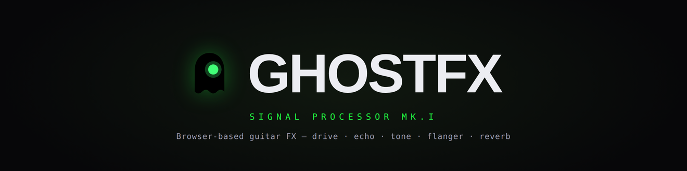

<div align="center">



<video src="assets/spin.mp4" width="420" autoplay loop muted playsinline></video>

</div>

Browser-based guitar effects pedal. Plug in, stomp, and shape your tone with
drive, echo, tone, flanger and reverb — no install, no plugins. It runs entirely
on the Web Audio API, with a real-time 3D pedal you can actually turn the knobs
on.

## Features

- Real-time signal chain: drive, echo, tone, flanger, reverb and master volume
- Live microphone input with built-in feedback protection
- Five voiced presets, each with its own amp and cabinet character, colour
  palette and animated backdrop
- Interactive 3D pedal — drag the knobs and stomp the footswitch
- On-screen keyboard synth and a built-in metronome
- Record your take and export it as MP3

## Stack

- **UI** — React 19 and TypeScript, bundled with Vite, styled with Tailwind CSS
- **3D** — Three.js via React Three Fiber and drei
- **Audio** — the native Web Audio API. The whole effects chain and DSP — drive
  curves, per-preset cabinet voicing, modulation and a zero-latency limiter — is
  hand-built node by node, with no audio framework. MP3 export uses lamejs.

## Development

```bash
npm install
npm run dev
```

Open the local URL Vite prints, allow microphone access and stomp to arm.

> Use headphones. The pedal processes your live microphone, so open speakers can
> feed back.

## Build

```bash
npm run build
npm run preview
```
