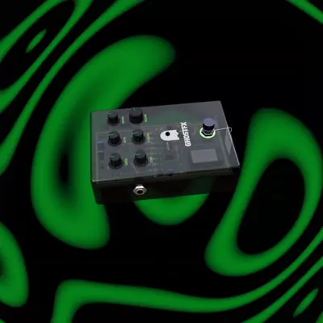

<div align="center">


<br/><br/>

[](LICENSE)


<br/>

**A guitar effects pedal that lives in your browser.**

Plug in, stomp to arm, and shape your tone with drive, echo, modulation and reverb
on a real-time 3D pedal whose knobs you actually turn. No install, no plugins,
no native app: the entire signal chain is hand-built on the Web Audio API.

<br/>


<sub><b>SIX PRESETS RE-THEME THE RIG&nbsp;&nbsp;·&nbsp;&nbsp;EVERY CONTROL IS A REAL 3D PART&nbsp;&nbsp;·&nbsp;&nbsp;STOMP TO ARM</b></sub>

</div>

## Six voiced presets

Each preset is a different pedal inside, not a saved knob position. Switching
rigs swaps the drive topology, the delay voice, the modulation circuit, the
cabinet and the reverb, then re-themes the whole interface: palette, backdrop,
even the chassis tint.

| Preset    | Character                                                                | Circuit                                                    |
| --------- | ------------------------------------------------------------------------ | ---------------------------------------------------------- |
| **GHOST** | The house voice. Mid-pushed drive that cleans up with your guitar volume. | screamer drive → tape echo → slow chorus → hall reverb      |
| **DOOM**  | Low-tuned fuzz wall. Chords collapse into sludge, single notes stay huge. | vintage fuzz → dark slap delay → cavern reverb              |
| **FROST** | Glassy clean platform with lush chorus. Every note stays articulate.      | clean boost → chorus → crystal delay → plate reverb         |
| **HEAVY** | Scooped high gain, tight and nearly dry. Palm mutes hit like a wall.      | rectifier drive → tight slap delay → room reverb            |
| **HAZE**  | Shoegaze weather system. Long saturating echoes under an endless reverb.  | smooth drive → tape wash delay → wide chorus → cathedral    |
| **FEVER** | Octave-up fuzz that rings like a circuit about to give up.                | octave fuzz → mid delay → fast wobble → dark reverb         |

## A real pedal, not a picture of one



Every control is a physical 3D part. Knobs turn under your pointer:
double-click resets, scroll fine-tunes. The footswitch clicks, the chassis
dips under the stomp, the camera orbits freely.

Under the translucent lid there is a full circuit board: DIP op amps, carbon
resistors, electrolytics with real markings, a reverb brick, all laid out
after an analog reference down to the silkscreen.

The pedal also powers on like hardware. Knobs wake at zero, and the first
stomp sweeps them into position as the LED eye lights up and your guitar goes
live through the chain.

<br clear="right"/>

## Signal chain

```
guitar in → drive → tone → tape echo → modulation → cab → reverb → limiter → out
```

Every stage is voiced per preset and built node by node on the native
Web Audio API: waveshaper drive curves with per-topology makeup gain, a
feedback delay loop with tape saturation and damping, a modulated delay voiced
as chorus or flanger, cabinet EQ, procedural convolution reverb and a
zero-latency soft limiter. Live microphone input runs through a feedback
guard that mutes the chain before a howl gets loose.

## Controls

| Do this                | To get                                            |
| ---------------------- | ------------------------------------------------- |
| Click the footswitch   | Arm or bypass the pedal                           |
| Drag a knob up or down | Turn it. Double-click resets, scroll fine-tunes   |
| Drag around the pedal  | Orbit the camera. Scroll zooms                    |
| Keys <kbd>1</kbd> to <kbd>6</kbd> | Switch presets                         |
| <kbd>Space</kbd>       | Start or stop recording                           |

There is also a built-in keyboard synth for when no guitar is around, and a
recorder that captures a take and exports it as MP3.

## Stack

- **UI**: React 19 and TypeScript, bundled with Vite, styled with Tailwind CSS
- **3D**: Three.js via React Three Fiber and drei
- **Audio**: the native Web Audio API with no audio framework; MP3 export uses lamejs

## Run it locally

```bash
npm install
npm run dev
```

Open the URL Vite prints, allow microphone access, and stomp to arm.

> **Use headphones.** The pedal processes your live microphone, so open speakers
> can feed back.

Build for production with `npm run build`, then preview it with `npm run preview`.

## License

[MIT](LICENSE)
