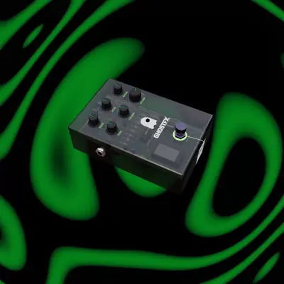
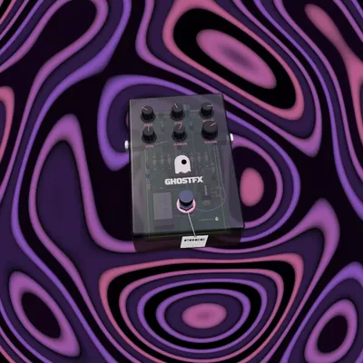

<div align="center">


<br/><br/>

**A guitar effects pedal that lives in your browser.**

Plug in, stomp to arm, and shape your tone with drive, echo, tone, modulation and
reverb — on a real-time 3D pedal whose knobs you actually turn.
No install, no plugins, no native app: the entire signal chain is hand-built
on the Web Audio API.

<br/>

<p>



</p>

<sub><b>SIX PRESETS RE-THEME THE RIG&nbsp;&nbsp;·&nbsp;&nbsp;EVERY CONTROL IS A REAL 3D PART&nbsp;&nbsp;·&nbsp;&nbsp;STOMP TO ARM</b></sub>

</div>

## Six voiced presets

GHOST, DOOM, FROST, HEAVY, HAZE and FEVER are not six knob positions — each one is
a different pedal inside: its own drive circuit (creamy screamer, near-square
fuzz, glassy clean, tight rectifier, smooth wall, octave-up fuzz), its own delay voice, its
own chorus or flanger, cabinet and reverb. Switch presets and the whole rig
re-themes — colour palette, backdrop, even the chassis tint.

## A real pedal, not a picture of one

Every control is a physical 3D part: knobs turn under your pointer
(double-click resets, scroll fine-tunes), the footswitch clicks, the camera
orbits. Under the translucent chassis there is a full circuit board — DIP op
amps, carbon resistors, a reverb brick — laid out after a real analog
reference, down to the silkscreen. Stomp and the signal goes live: the LED
eye lights up, the knobs sweep into position and your guitar is running
through the chain.

## Features

- **Real-time signal chain** — drive, echo, tone, modulation, reverb and master volume, all live
- **Plays your guitar** — live microphone input with built-in feedback protection
- **Six voiced presets** — each with its own amp and cabinet voicing, colour palette and animated backdrop
- **Hands-on 3D pedal** — drag the knobs and stomp the footswitch
- **Keyboard synth & metronome** — built in, for when there's no guitar around
- **Record & export** — capture a take and download it as MP3

## Controls

| Do this                 | To get                                              |
| ----------------------- | --------------------------------------------------- |
| Click the footswitch    | Arm / bypass the pedal                              |
| Drag a knob up or down  | Turn it — double-click resets, scroll fine-tunes    |
| Drag around the pedal   | Orbit the camera — scroll zooms                     |
| Pick a preset           | Swap the whole rig: voicing, palette and backdrop   |
| <kbd>Space</kbd>        | Start / stop recording                              |
| Keyboard synth          | Play notes from your computer keyboard              |

## Stack

- **UI** — React 19 and TypeScript, bundled with Vite, styled with Tailwind CSS
- **3D** — Three.js via React Three Fiber and drei
- **Audio** — the native Web Audio API, no audio framework. The whole effects chain
  and DSP — drive curves, per-preset cabinet voicing, modulation, convolution
  reverb and a zero-latency limiter — is built node by node; MP3 export uses lamejs.

## Run it locally

```bash
npm install
npm run dev
```

Open the URL Vite prints, allow microphone access, and stomp to arm.

> **Use headphones.** The pedal processes your live microphone, so open speakers
> can feed back.

Build for production with `npm run build`, then preview it with `npm run preview`.
