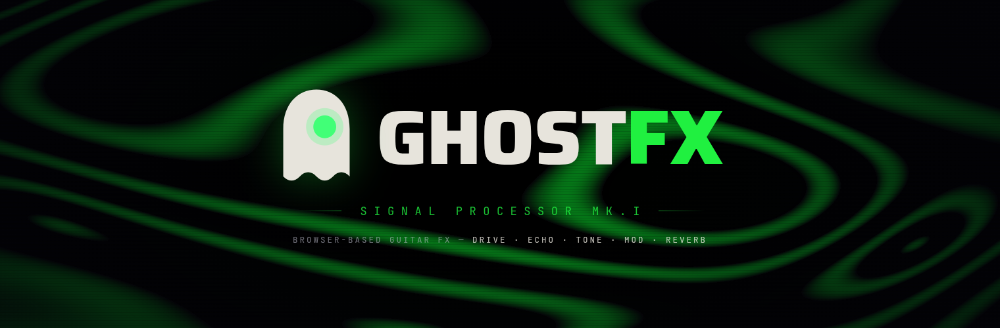
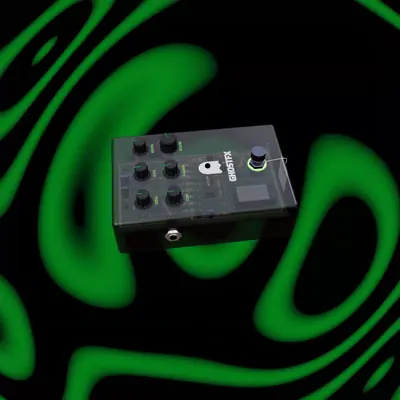

<div align="center">



<br/><br/>

[](LICENSE)


<br/>

**A guitar effects pedal that lives in your browser, with a studio behind it.**

<sub><b>STUDIO · MK.II</b></sub>

Plug in, stomp to arm, and shape your tone with drive, echo, modulation and reverb
on a real-time 3D pedal whose knobs you actually turn. Then record it: takes, a
layered looper, a backing track you drop in, all trimmed and mixed down to MP3
without leaving the tab. No install, no plugins, no native app: the entire signal
chain is hand-built on the Web Audio API.

<br/>


<sub><b>SIX PRESETS RE-THEME THE RIG&nbsp;&nbsp;·&nbsp;&nbsp;EVERY CONTROL IS A REAL 3D PART&nbsp;&nbsp;·&nbsp;&nbsp;STOMP TO ARM</b></sub>

</div>

## Six voiced presets

Each preset is a different pedal inside, not a saved knob position. Switching
rigs swaps the drive topology, the delay voice, the modulation circuit, the
cabinet and the reverb, then re-themes the whole interface: palette, backdrop,
even the chassis tint.

| Preset    | Character                                                                | Circuit                                                    |
| --------- | ------------------------------------------------------------------------ | ---------------------------------------------------------- |
| **GHOST** | The house voice. Edge of breakup, cleans up under your hands.             | screamer drive → tape echo → hall reverb                    |
| **DOOM**  | Sludge with the bottom left open, dragged through a cavern.               | vintage fuzz → dark slap → cavern reverb                    |
| **FROST** | Glassy clean platform with lush chorus. Every note stays articulate.      | clean boost → chorus → crystal delay → plate reverb         |
| **HEAVY** | Scooped high gain, tight and nearly dry. Palm mutes hit like a wall.      | rectifier drive → tight slap delay → room reverb            |
| **SMOKE** | A small valve amp on the edge of breakup. Soft it stays clean, dug in it growls. | tube drive → slapback → amp tremolo → spring                 |
| **FEVER** | The lead voice. Cuts through anything, with repeats to lean on.           | singing drive → mid bump → repeats → open plate             |

## A real pedal, not a picture of one



Every control is a physical 3D part. Knobs turn under your pointer:
double-click resets, scroll fine-tunes. The footswitch clicks, the chassis
dips under the stomp, the camera orbits freely.

Under the translucent lid there is a full circuit board: DIP op amps, carbon
resistors, electrolytics with real markings, a reverb brick, all laid out
after an analog reference down to the silkscreen.

The pedal also powers on like hardware. Knobs wake at zero, and the first
stomp sweeps them into position as the LED eye lights up and your guitar goes
live through the chain.

<br clear="right"/>

## The studio

Everything you record lives in one deck under the pedal, and opens into a
full-screen studio when it needs room.

- **Takes.** Hit record and the take lands in the rack. Play it back through a
  different rig and it re-amps live, because the dry signal is captured
  alongside the wet one and runs through the real chain on playback. The five
  signal faders move that take while it plays, and the export follows what you
  hear.
- **Repeat.** Any take or imported file can be left repeating in the background,
  trimmed to the part you want, so you can solo over your own phrase. Record
  again and the new take carries what was playing under it.
- **Backing track.** Drop an audio file on the deck, up to three minutes. It is
  decoded and played locally, never uploaded, and it never touches the recording
  tap: takes stay guitar-only while the export mixes the backing back in.
- **Trim and export.** Drag the edges of any waveform to keep only what matters,
  take, loop or imported file, then export it as MP3. Trimming is
  non-destructive.

## Signal chain

```
guitar in → drive → tone → tape echo → modulation → cab → reverb → limiter → out
```

Every stage is voiced per preset and built node by node on the native
Web Audio API: waveshaper drive curves with per-topology makeup gain, a
feedback delay loop with tape saturation and damping, a modulated delay voiced
as chorus or flanger, cabinet EQ, procedural convolution reverb and a
zero-latency soft limiter. Live microphone input runs through a feedback
guard that mutes the chain before a howl gets loose.

## Controls

| Do this                | To get                                            |
| ---------------------- | ------------------------------------------------- |
| Click the footswitch   | Arm or bypass the pedal                           |
| Drag a knob up or down | Turn it. Double-click resets, scroll fine-tunes   |
| Drag around the pedal  | Orbit the camera. Scroll zooms                    |
| Keys <kbd>1</kbd> to <kbd>6</kbd> | Switch presets                         |
| <kbd>B</kbd>           | Bypass the pedal. Hold it to compare              |
| <kbd>Space</kbd>       | Start or stop recording a take                    |

There is also a built-in keyboard synth for when no guitar is around, a tuner
and a metronome with count-in.

## Stack

- **UI**: React 19 and TypeScript, bundled with Vite, styled with Tailwind CSS
- **3D**: Three.js via React Three Fiber and drei
- **Audio**: the native Web Audio API with no audio framework; MP3 export uses lamejs

## Run it locally

```bash
npm install
npm run dev
```

Open the URL Vite prints, allow microphone access, and stomp to arm.

> **Use headphones.** The pedal processes your live microphone, so open speakers
> can feed back.

Build for production with `npm run build`, then preview it with `npm run preview`.

## License

[GPL-3.0](LICENSE). Use it, learn from it, fork it; keep it open.
